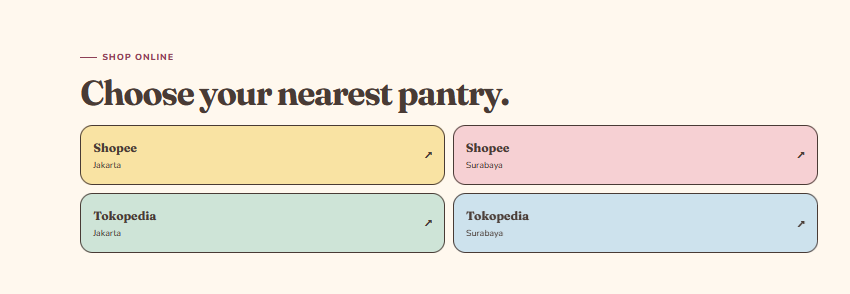

- Redesign this section with a professional UI/UX approach. Maintain the existing branding and products, but improve layout, spacing, alignment, visual hierarchy, image composition, typography, and shadows. Remove clutter, reduce unnecessary overlaps, create a clear focal point, and make the section feel modern, premium, and visually balanced while remaining responsive. 
- Redesign this "Choose your nearest pantry" section into a modern, premium, and playful e-commerce showcase. Replace the plain cards with visually appealing marketplace cards using the official Shopee and Tokopedia icons. Display each marketplace as a polished mockup card with subtle gradients, soft shadows, rounded corners, hover animations, and a clear CTA. Improve spacing, typography, hierarchy, and color consistency while keeping the cream background and brand identity. Make the layout feel cleaner, more engaging, and responsive, with marketplace logos as the main visual focus.
Redesign the product cards into a premium e-commerce experience. Keep the current branding but improve the card layout, spacing, typography, and hierarchy. Add a "View Details" interaction that expands the card (or opens a side panel/modal) with additional product information instead of navigating away. The expanded detail should include:

Product gallery with multiple images
Product description
Ingredients
Nutrition facts
Available sizes (10g, 30g, 85g)
Flavor profile
Allergens information
Storage instructions
Halal certification
Product benefits (No Preservatives, No Artificial Color, No Flavor Enhancer)
Customer rating & reviews
Related products
"Find Store" and "Buy Online" CTA buttons

Use smooth expand animations, rounded corners, soft shadows, clean spacing, and maintain a playful yet premium aesthetic. The interaction should feel modern, responsive, and intuitive.