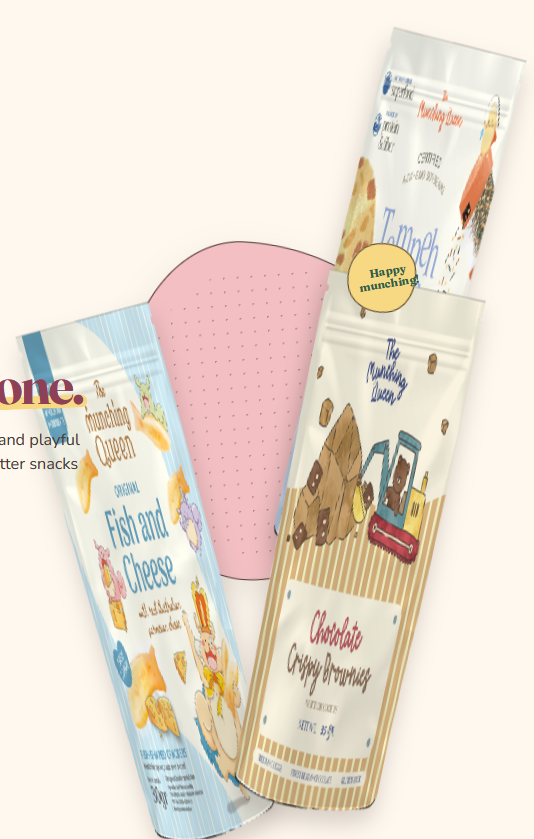

- Redesign this section with a professional UI/UX approach. Maintain the existing branding and products, but improve layout, spacing, alignment, visual hierarchy, image composition, typography, and shadows. Remove clutter, reduce unnecessary overlaps, create a clear focal point, and make the section feel modern, premium, and visually balanced while remaining responsive. 
- redesign 